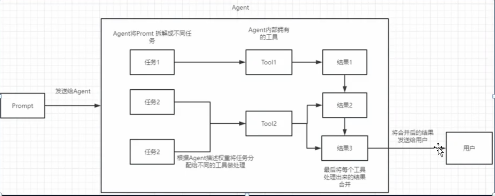
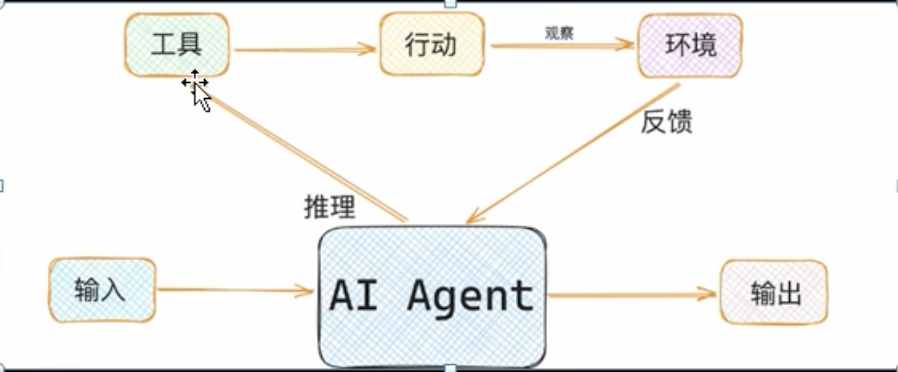

# langchain 是一个工具集

1. 大模型包装(LLM Wrappers)各种大模型连接或调用的 封装
2. 各种Prompt模板
3. chain(链)可以把各个组件组合在一起使用
4. 缓存的支持，比如 内存、soLite、Redis
5. 文档分割、向量化
6. Agent，接收用户的输入，采取相应的行动然后返回行动的结果

# 安装

> python 版本3.10+

设置国内源

```shell
pip config set global.index-url https://pypi.tuna.tsinghua.edu.cn/simple
```

安装langchain

```shell
pip install langchain
```

小插曲(也许你没问题)

```shell
# 降低tenacity的版本8.4.0 -> 8.3.0， 目前最新版8.4.0
pip uninstall tenacity
pip install 'tenacity==8.3.0'
```

如果没有openai 的key， 可以使用kimi的代替，kimi支持openai， 可以使用同样的代码进行调用。 打开月之暗面，自行搞定apikey的获取
https://platform.moonshot.cn

```
sk-OkJ780rADWR2b4jJ83Gcm5GvzCyTN5UCmkiEpvhNeVUtF8JU
```

langchain 文档，重要的一批(自行更换到最新版本)
https://python.langchain.com/v0.2/docs/integrations/platforms/openai

## openai 调用

安装langchain openai的子模块

```shell
pip install langchain-openai
```

kimi的几个参数

```
model="moonshot-v1-8k",
base_url='https://api.moonshot.cn/v1'
```

示例

```py
import os

from langchain_openai import ChatOpenAI

if __name__ == "__main__":
    llm = ChatOpenAI(
        model="moonshot-v1-8k",
        base_url='https://api.moonshot.cn/v1',
        api_key=os.environ.get("KIMI_API_KEY")
    )
    # 通义千问
    #tongyi = ChatOpenAI(
    #    model="qwen-max",
    #    base_url='https://dashscope.aliyuncs.com/compatible-mode/v1',
    #    api_key=""
    #)
    res = llm.invoke("2024年奥运会举办地在哪里？该城市有什么著名景点？")
    print(res.content)
```

# Agent


agent就是帮助我们或者代表我们做一些事情。

可以这么理解

用户提出问题时首先 由它（可以是手工可以是llm去，比如我们之前的爬虫就是手工抓取的数据）去理解和拆分，从工具列表中找到合适的工具，然后将用户提问的信息转换为结构化的数据，当成参数传递给工具函数。

工具函数返回结果又交给大模型去观察分析，如果它觉得不是正确答案，那么继续这个循环直到得出他认为的正确答案。




## 最常用的类型

### action agent

使用先前操作的输出来决定下一步的操作：既每一步操作都会立即去执行，得到输出后使用该输出作为下一步的决策和操作。

你需要创建几个组件

- tools（可以是个函数或者类
- outputparser,prompttemplate
- agent(多个类型)
- agent executor

#### tools 的写法

以定义一个加法tool为例

```py
from langchain.tools import BaseTool
from pydantic.v1 import BaseModel, Field
from typing import Optional


class AddToolArgs(BaseModel):
    a: int = Field(description="加数a")
    b: int = Field(description="加数b")


class AddTool(BaseTool):
    name: str = "addtool"
    description: str = "加法运算使用本工具"
    args_schema: Optional[type] = AddToolArgs

    def _run(self, a: int, b: int) -> int:
        """执行加法运算"""
        return a + b


if __name__ == "__main__":
    myadd = AddTool()
    # 使用 run 方法调用工具
    result = myadd.invoke({"a": 1, "b": 2})
    print(result)  # 输出: 3
```


### 定义输出解析器和模板


关于PromptTemplate 的格式：

https://python.langchain.com.cn/docs/modules/agents/how_to/custom_llm_agent

https://smith.langchain.com/hub/hwchase17/react
```
Answer the following questions as best you can. You have access to the following tools:

{tools}

Use the following format:

Question: the input question you must answer
Thought: you should always think about what to do
Action: the action to take, should be one of [{tool_names}]
Action Input: the input to the action
Observation: the result of the action
... (this Thought/Action/Action Input/Observation can repeat N times)
Thought: I now know the final answer
Final Answer: the final answer to the original input question

Begin!

Question: {input}
Thought:{agent_scratchpad}
```


from langchain.agents import create_react_agent
Reasoning and Action



# hub，拉取prompt

```shell
pip install langchainhub
```

